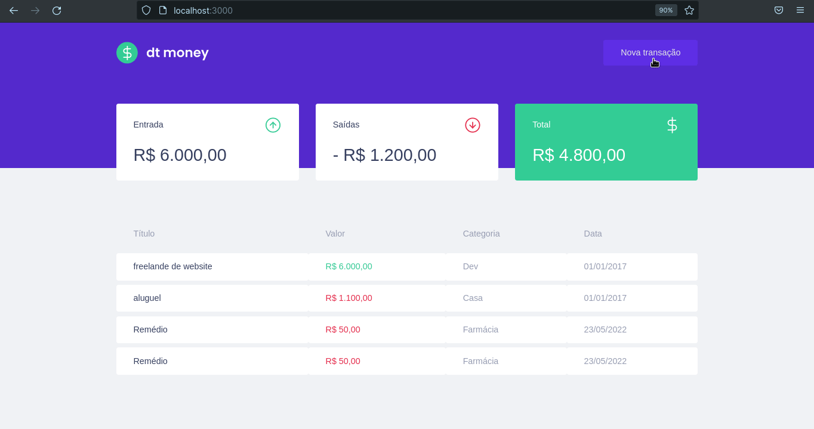

<h1 align="center"></h1>

<p align="center">Este projeto é uma gestor financeiro pessoal que controla as entradas e saidas</p>

<p align="center">
 <a href="#features">Features</a> •
 <a href="#pré-requisitos">Pré Requisitos</a> •
 <a href="#rodando-o-mobile">Rodando a aplicação</a> •
 <a href="#tecnologias">Tecnologias</a> •
 <a href="#autor">Autor</a>
</p>

---

<br>


<h1 align="center">
  
 

</h1>


### Features

- [x] Cadastrar Transação
- [x] Apresentar  Transação
- [ ] Deletar Transação
- [ ] Editar Transação


### Pré-requisitos

Antes de começar, você vai precisar ter instalado em sua máquina as seguintes ferramentas:
[Git](https://git-scm.com), [Node.js](https://nodejs.org/en/).

Além disto é importante ter um editor para trabalhar com o código como [VSCode](https://code.visualstudio.com/)


### Rodando em Web

```bash
# Clone este repositório
$ git clone https://github.com/LuanLeiteLeao/02-dtmoney.git

# Acesse a pasta do projeto no terminal/cmd
$ cd 02-dtmoney

# Instale as dependências
$ npm install

# Inicar o servidor de desenvolvimento 
$ npm run dev
```


### Tecnologias

As seguintes ferramentas foram usadas na construção do projeto:

- [TypeScript](https://www.typescriptlang.org/)
- [Babel](https://babeljs.io/)
- [Webpack](https://webpack.js.org/)
- [axios](https://axios-http.com/)    
- [miragejs](https://miragejs.com/)
- [web-vitals](https://sentry.io/for/web-vitals/)
- [polished](https://polished.js.org/)
- [styled-components](https://styled-components.com/)
- [reactjs](https://reactjs.org/)


---

### Autor


Feito com ❤️ por Luan Leite Leão 👋🏽 Entre em contato!

[](https://www.linkedin.com/in/luan-leite-le%C3%A3o-344622196/)
[](mailto:leaoluanleite@gmail.com)